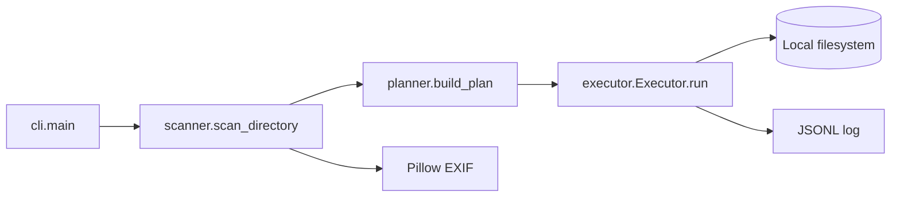

# Component Architecture

## Components

### CLI

`build_parser` exposes directory, execute/copy mode, folder format, source priority, log path, and log-disable options. `main` prints a human-readable summary and returns `2` for invalid directory or source input.

### Scanner

`is_media_file` uses a fixed extension set. `parse_filename_date` matches known date patterns; `parse_exif_date` reads three EXIF tags; `parse_mtime_date` supplies a filesystem timestamp fallback. `scan_directory` enumerates only direct files.

### Planner

`build_plan` maps dated `FileInfo` records to `MoveOp` instances. Undated files are returned in `skipped`; folder tokens `YYYY`, `MM`, and `DD` are replaced by string substitution.

### Executor

`Executor.run` detects an existing destination, prints dry-run operations, or calls `shutil.copy2`/`shutil.move`. Successful real operations are appended to the configured JSONL log. Errors are printed and counted as skipped.

## Dependency direction

The CLI depends on all three lower layers. The planner depends on scanner data types. The executor depends on planner data types. No lower layer imports the CLI.

## Status

`partially-verified`: the module graph is present and scanner tests pass; the planner/executor/CLI interaction is not covered by integration tests.
