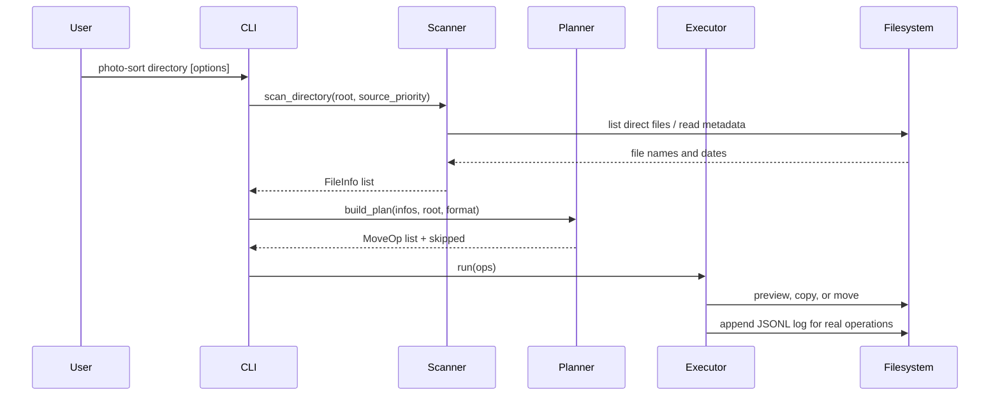

# Data Flow

1. `cli.main` resolves the input directory and builds date-source callables from `--source`.
2. `scanner.scan_directory` lists direct child files and produces `FileInfo` records.
3. Each media file is offered to date sources in priority order until one returns a date.
4. `planner.build_plan` converts dated records into source/destination `MoveOp` records and returns undated records separately.
5. `executor.Executor.run` skips existing destinations, prints dry-run operations, or performs copy/move operations.
6. Real successful operations are appended to the configured JSONL log.

## Data handling notes

- Paths and media metadata remain local to the process.
- EXIF values are parsed into `datetime` objects and not persisted separately.
- The log contains source path, destination path, date, source label, and action; it may expose local filesystem paths.
- No authentication or authorization is applicable to the local CLI, so OS filesystem permissions are the primary boundary.
